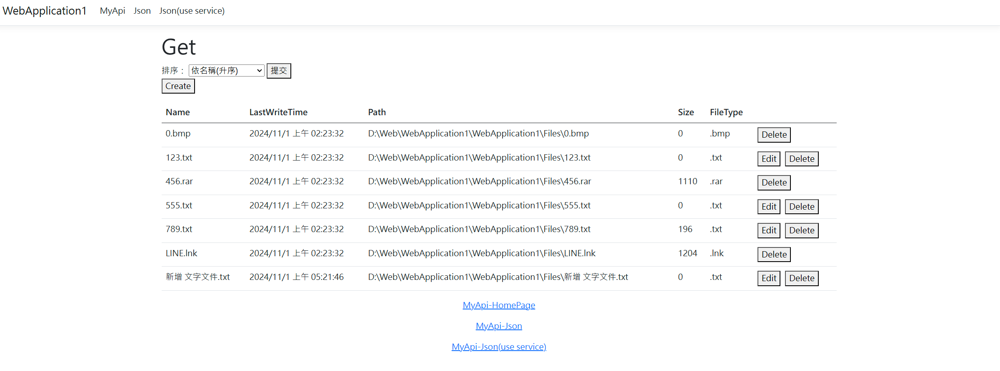

# WEB

在此專案中 我使用了基本的MVC架構，
我自己創立了一個"MyApi"controller，裡面有GET和POST
GET做初始值得讀取
POST用到了AJAX 和 jQuery來實踐 我的功能(使用一個dropdownlist 來使得丟出一個POST到後段給 GetOrderBySelection)，回傳List<MyApiViewModel>給前端最後做顯示邏輯。

## 專案說明
## 此sideproject為，我讓專案讀取Files資料夾內的檔案，並記錄他的名稱、路徑、寫入時間和檔案大小，並且結合前端的HTML、CSS、Javascript和Ajax，後端的Asp.net core MVC 經過Route、依賴注入、EntityFrameworkCore和Microsoft SQL Server的專案，其功能有檔案的排序、檔案的CRUD還有展示檔案傳遞的JSON格視為何。 

## 功能敘述
[功能敘述](./WebApplication1/WebApplication1/README.md)

